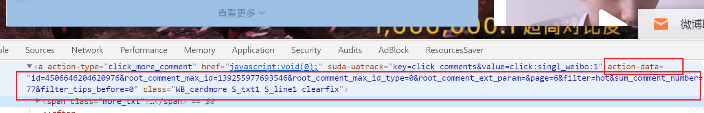
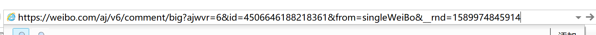
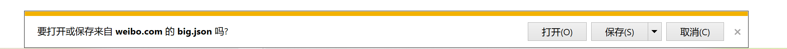
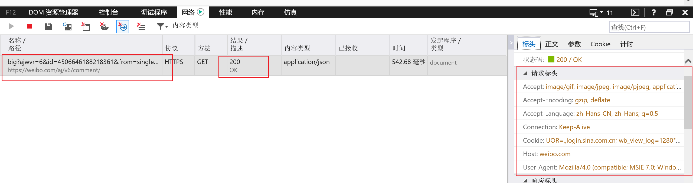

# 微博热门评论爬取

## 编程目标

实现给定关键词，爬取搜索页面 `https://s.weibo.com/weibo?q={keword}&` 所有标记有"热门" post的所有一级评论，并保存于txt，用于情感分析材料。


例如:  搜索目标关键字 **刘亦菲**  即是访问网页 `https://s.weibo.com/weibo?q=刘亦菲&` 所有带有热门关键词的微博评论

## 技术应用

### AJAX

`Ajax实际就是XMLHttpRequest对象和DOM、(X)HTML和CSS的简称，用于概括异步加载页面内容的技术。实际上，页面是在后台与服务器进行数据交互，获得了数据之后，再利用JavaScript改变网页，这样网页的内容就会被更新了`


常见的表现形式有：

- 网页列表下拉自动刷新新内容
- 点击*加载更多* 刷新新内容

上面两种形式在浏览器状态栏上的请求URL都不会变化！

**原理如下：**

> *那些刷新的新数据是通过AJAX加载而来的，是一种异步加载方式，原始的页面最初不会包含某些数据，原始页面加载完后，会再向服务器请求某个接口获取数据，然后数据才被处理从而呈现到网页上，这其实就是发送了一个Ajax请求。按照Web发展的趋势来看，这种形式的页面越来越多。网页的原始HTML文档不会包含任何数据，数据都是通过Ajax统一加载后再呈现出来的，这样在Web开发上可以做到前后端分离，而且降低服务器直接渲染页面带来的压力。*
>


如何观察一个网页的AJAX请求：（chrome为例）**


刷新页面观察 AJAX请求头、响应头、相应内容等


**如何调试一个网页的AJAX请求：（chrome为例）**

以往的静态页面爬虫，为构造出爬虫的url请求、我们需要分析网页的url规律和参数变化。例如爬取小说目录，我们需要分析每一页的章节数目和变化规律，确保目录的准确性！

而在AJAX里面我们需要分析AJAX请求头的url的规律，一次作为突破口，制作一个持续的爬虫。常常我们需要url

的构造方法，和静态页面不同的是，AJAX的请求url通常非常长和复杂，对比分析出每个参数意义是非常重要的。这里我们可以下载网页的所有资源，让后通过IDE来搜索调试，查看请求URL的构造和数据的变化！

这里下载插件:chrome 插件 Resources Saver  和 JavaScript IDE webstorrm


下载所有资源，并用IDE打开，搜索url涉及的关键字等，可以得到意想不到的收获。（以上全部来自自己的无数次的摸索）


参考文章（非常经典） ： https://blog.csdn.net/weixin_42555080/article/details/88318010 


### BeautifulSoup

BeautifulSoup用于解析网页爬虫的返回结果，这里不多叙述（课程上有讲）

标记一下很重要的点：

```
1. find寻找标签失败，返回None  若要get其属性，需要判断 非None 否则抛出错误

2. 获取标签文本，但是不获取其子标签的文本  get_text()  默认是递归方式获取标签文本
解决方法: comment目标标签  其包含若干个带有文本的子标签   s为comment标签的文本
s = "".join([t for t in comment.contents if type(t) == bs4.element.NavigableString])
```

### selenium

**参考文档** [ https://github.com/easonhan007/webdriver_guide/blob/master/README.md](https://github.com/easonhan007/webdriver_guide/blob/master/README.md)

**注 本文以AJAX请求爬取为主**

除却分析AJAX请求，构造出通用的url外，selenium自动化也是很好的爬取方法动态网页方法

下面是一份 输入评论页面url，输出为：

1. 打开浏览器
2. 不断点击评论页面 加载更多 
3. 爬取（未实现 很简单 网页元素加载完毕就可以点击，缺点是有点慢）


```
# 教程概览 https://blog.csdn.net/huangbaokang/article/details/83503677
# 教程文档 https://github.com/easonhan007/webdriver_guide/blob/master/README.md
# 元素定位和点击事件 https://github.com/easonhan007/webdriver_guide/blob/master/08/simple_locate.py.md
# 打开浏览器

from selenium import webdriver
import time

from selenium.common.exceptions import NoSuchElementException


# 实现页面自动下移
def scroll(driver):
    # 获取当前页面滚动条纵坐标的位置
    driver.execute_script(""" 
        (function () { 
            var y = document.documentElement.scrollTop; 
            var step = 100; 
            window.scroll(0, y); 
            function f() { 
                if (y < document.body.scrollHeight) { 
                    y += step; 
                    window.scroll(0, y); 
                    setTimeout(f, 50); 
                }
                else { 
                    window.scroll(0, y); 
                } 
            } 
            setTimeout(f, 1000); 
        })(); 
        """)


# 打开浏览器
dr = webdriver.Chrome()
# 最大化浏览器
dr.maximize_window()
# 设置大小
url = 'https://weibo.com/3165034955/J1aeZFLwk?filter=hot&root_comment_id=0&type=comment'

dr.get(url)
time.sleep(3)

while True:
    scroll(dr)
    try:
        dr.find_element_by_xpath(
            '//*[@id="Pl_Official_WeiboDetail__73"]/div/div/div/div[4]/div/div[2]/div[2]/div/div/a').click()
    except NoSuchElementException:
        print("No such element")
    time.sleep(2)

# 退出
# close方法关闭当前的浏览器窗口，
# quit方法不仅关闭窗口，还会彻底的退出 webdriver，
# 释放与driver server之间的连接。
# 所以简单来说quit是更加彻底的 close，
# quit会更好的释放资源，适合强迫症和完美主义者


# dr.quit()


# (<class 'selenium.common.exceptions.NoSuchElementException'>, NoSuchElementException('no such element: Unable to locate element: {"method":"link text","selector":"查看更多"}\n  (Session info: chrome=81.0.4044.138)', None, None), <traceback object at 0x00000201C73E5348>)

```


## 微博评论

### 评论分析

**首先打开一个post的评论页面，页面如下，包含很多的以及评论**


**刷新：查看XHR 、观察Preview数据**


**可以看到：第一条XHR就是第一次加载的评论！**


下拉，点击加载更多：加载更多的数据，通过分析查看 以  `https://www.weibo.com/aj/v6/comment/big?ajwvr=6&id=4506646204620976`为首的请求正是我们需要的评论数据


我们复制url请求、分析规律：

```
https://www.weibo.com/aj/v6/comment/big?ajwvr=6&id=4506646204620976&from=singleWeiBo&__rnd=1589971809202


https://www.weibo.com/aj/v6/comment/big?ajwvr=6&id=4506646204620976&root_comment_max_id=139255979119461&root_comment_max_id_type=0&root_comment_ext_param=&page=5&filter=hot&sum_comment_number=62&filter_tips_before=0&from=singleWeiBo&__rnd=1589971825396

https://www.weibo.com/aj/v6/comment/big?ajwvr=6&id=4506646204620976&root_comment_max_id=139255979119461&root_comment_max_id_type=0&root_comment_ext_param=&page=5&filter=hot&sum_comment_number=62&filter_tips_before=0&from=singleWeiBo&__rnd=1589971825396

https://www.weibo.com/aj/v6/comment/big?ajwvr=6&id=4506646204620976&root_comment_max_id=139255979119461&root_comment_max_id_type=0&root_comment_ext_param=&page=5&filter=hot&sum_comment_number=62&filter_tips_before=0&from=singleWeiBo&__rnd=1589971825396

https://www.weibo.com/aj/v6/comment/big?ajwvr=6&id=4506646204620976&root_comment_max_id=139255979119461&root_comment_max_id_type=0&root_comment_ext_param=&page=5&filter=hot&sum_comment_number=62&filter_tips_before=0&from=singleWeiBo&__rnd=1589971825396
```


除去第一条外：其余的url格式是一样的！

总结出非首条URL的规律如下: **关注action_data 和 rnd 字段**

```
dict = {"action_data": action_data, "rnd": __rnd()}
url = "https://weibo.com/aj/v6/comment/big?ajwvr=6&{action_data}&from=singleWeiBo&__rnd={rnd}".format(**dict)
```

**action_data** 分析

action_data是很多参数的集合：顾名思义这个是请求action使得参数，一般在请求下一页的a标签可以获取！查看源码：action_data和请求的url完全对应



思考一个问题：action_data从哪里来，显然他是从AJAX请求里面获取的数据：

查看一个典型的 AJAX结构：json数据的data.html 就是新加入的页面的网页元素！


分析内容（爬取并且打印）

```html
<div action-data="id=4506646188218361&amp;root_comment_max_id=9545852827862303&amp;root_comment_max_id_type=0&amp;root_comment_ext_param=&amp;page=2&amp;filter=hot&amp;sum_comment_number=20745&amp;filter_tips_before=0" node-type="comment_loading">
<div class="WB_empty">
<div class="WB_innerwrap">
<div class="empty_con clearfix">
<p class="text"><i class="W_loading"
```

显然：下一个请求的action_data可以从上一个请求的响应数据里构造，而最初的第一个请求的action_data是缺失的，这样就可以连续的构造请求！ **perfect！！！**


**rnd分析**

rnd没有任何的资料，直接查看chrome源码很难受（通过AJAX调试方法，前面介绍过）我们可以下载内容，webstorm打开并且搜索调试：


定位如下：这是一个时间戳信息  在python里面是时间戳保留三位小数的结果

```javascript
   url.setParams(opts.args);
                    url.setParam("__rnd", (new Date).valueOf());
                    trans.open(opts.method, url.toString(), opts.asynchronous);
                    try {
                        for (var k in opts.header) trans.setRequestHeader(k, opts.header[k])
                    } catch (exp) {}
```


至此所有的构造出来了，唯一的缺陷是第一条数据的id是哪里来的！我们可以看出每条请求的都要这个ID，一看就知道他是一个类似身份证号的一个主键！

**id分析**

从这个评论页面是看不出来id是这么来的，他是通过搜搜页面点击 **评论**而来的，记住和id，回到上一页面，搜索这个id！


容易发现：所谓的AJAX 请求的id实际上就是这个mid，并且一个`div class="card-wrap"` 就是一个post！

所有我们就可以根据 单纯的一个mid爬取所有的mid对应的post的所有一级评论！

初始的ajax url构造为 `https://www.weibo.com/aj/v6/comment/big?ajwvr=6&id={mid}&from=singleWeiBo&__rnd={__rnd()}`


故而输出一个mid，爬取对饮post的所有一级评论：

代码如下：

```
# ajax请求
def get_url(url: str, f=None, headers=headers):
    c = []
    response = requests.get(url, headers=headers)
    if response.status_code != 200:
        print("Ajax Response Error")
        return None
    response = json.loads(response.text)
    if response:
        soup = BeautifulSoup(response.get('data').get('html'), "lxml")
        print(soup)
        comments = soup.find_all("div", attrs={"class": "WB_text"})
        for comment in comments:
            s = "".join([t for t in comment.contents if type(t) == bs4.element.NavigableString])
            s = s.strip().replace("\n", "").lstrip("：").replace("等人", "")
            if s:
                print(s)
                c.append(s + "\n")
            # https://www.zhihu.com/question/56861741
        if f:
            f.writelines(c)
        global result
        with lock:
            result += c
        action_data = soup.find("a", attrs={"action-type": "click_more_comment"})
        if not action_data:
            action_data = soup.find("div", attrs={"node-type": "comment_loading"})
            if not action_data:
                return None
        action_data = action_data.get("action-data").strip().replace("amp;", "")
        # print("action_data is " + action_data)
        dict = {"action_data": action_data, "rnd": __rnd()}
        if action_data:
            url = "https://weibo.com/aj/v6/comment/big?ajwvr=6&{action_data}&from=singleWeiBo&__rnd={rnd}".format(
                **dict)
        else:
            url = None
    return url


# 循环请求：
// url 为初始的第一条url  余下的自动更新url
def hot_ajax(url):
    while url:
        time.sleep(1)
        url = get_url(url)


```


**热门评论mid**

```
# 热门话题的url mid解析
def get_hot_by_search(url):
    response = requests.get(url)
    html = response.content.decode("utf-8")
    print(html)
    html = BeautifulSoup(html, "lxml")
    cards = html.find_all("div", attrs={"class": "card-wrap"})
    hot_mids = []
    for card in cards:
        titles = card.find_all("a")
        for title in titles:
            if title:
                if "热门" == title.text:
                    print(title.text)
                    hot_mids.append(card.get("mid"))
                    break
    print(hot_mids)
    return hot_mids
    
# 获取开始请求 search为关键词
def get_hot_mid_by_search(search: str):
    search = parse.quote(search)
    search = "https://s.weibo.com/weibo?q={0}&".format(search)
    print(search)
    hot_mids = get_hot_by_search(search)
    print(hot_mids)
    hot_ajax_start = []
    for mid in hot_mids:
        hot_ajax_start.append(
            "https://weibo.com/aj/v6/comment/big?ajwvr=6&id={0}&from=singleWeiBo&__rnd={1}".format(mid, __rnd()))
    return hot_ajax_start
```


### 关于cookie

通过反复的测试

有如下规则：

1. [https://s.weibo.com/weibo?q={keyword}&](https://s.weibo.com/weibo?q=刘亦菲&) 访问不要cookie！ 输入关键字，构造请求url即可

   ```
    response = requests.get(url)
   ```

2. AJAX信息爬取可以不登录，但是一定需要headers和cookie

   为了简化爬取，最好使用不登录的AJAX cookie去爬取（防止用例过猛封号），这里我使用IE去请求ajax的开始url：例如

   ```
   https://weibo.com/aj/v6/comment/big?ajwvr=6&id=4506646188218361&from=singleWeiBo&__rnd=1589974845914
   ```

   在IE输入，会输出一个json文档：

   




​		**打开IE开发工具：访问页面 查看请求标头**

​		

​	

**构造正确的标头：例如程序使用的header：基于IE的不登陆cookie**

```
# 修改cookies得到新的请求  在合适的浏览器copy出请求的参数
headers = {
    'Accept': 'image/gif, image/jpeg, image/pjpeg, application/x-ms-application, application/xaml+xml, application/x-ms-xbap, */*',
    'Accept-Encoding': 'gzip, deflate',
    'Accept-Language': 'zh-Hans-CN, zh-Hans; q=0.5',
    'Connection': 'Keep-Alive',
    'Cookie': 'SUB=_2AkMpmGNfdcPxrAZZkf8TymrmaYhH-jyaTQqpAn7uJhMyAxh77lUCqSVutBF-XEcZoLdAAUhhdFH_OTIESN5YwCgm; _s_tentry=-; Apache=8383124929170.817.1589954045328; TC-V5-G0=4de7df00d4dc12eb0897c97413797808; Ugrow-G0=140ad66ad7317901fc818d7fd7743564; TC-Page-G0=62b98c0fc3e291bc0c7511933c1b13ad|1589963875|1589963875; UOR=,,login.sina.com.cn; SINAGLOBAL=7390078349060.063.1589116949157; webim_unReadCount=%7B%22time%22%3A1589963878449%2C%22dm_pub_total%22%3A0%2C%22chat_group_client%22%3A0%2C%22chat_group_notice%22%3A0%2C%22allcountNum%22%3A39%2C%22msgbox%22%3A0%7D; ULV=1589954045516:5:5:3:8383124929170.817.1589954045328:1589727942460; SUHB=0nleBnbCAt0qZa; SUBP=0033WrSXqPxfM72wWs9jqgMF55529P9D9WFM0ZAQ0We2E62STc0UE.Bl5JpV8GD3q0.RSonpeo.Re.5pSoeVqcv_; wb_view_log_5897661455=1280*8002; login_sid_t=cf5e8bd6bb1862b4dacf3cdf346c4223; cross_origin_proto=SSL; WBStorage=42212210b087ca50|undefined; wb_view_log=1280*8002',
    'Host': 'weibo.com',
    'User-Agent': 'Mozilla/4.0 (compatible; MSIE 7.0; Windows NT 10.0; WOW64; Trident/7.0; .NET4.0C; .NET4.0E; .NET CLR 2.0.50727; .NET CLR 3.0.30729; .NET CLR 3.5.30729)'
}
```

3. 爬取使用单线程、定时sleep，以防止cookie被封！ 下图是我一次用登陆微博账号的cookie爬取数据，爬取的太凶猛了导致chrome无法正确加载！ AJAX无法正常加载

   


## 

## 完整脚本

### 用法：

运行脚本：`python3 Weibo-comment/__init__.py`

输入查询关键字 `请输入微博查询关键字：刘亦菲`

输出 `控制台信息`、`本机目录下包含{关键字}热门话题评论的 {关键字}.txt  `


```
import threading

import bs4
import requests
import json
import os
from bs4 import BeautifulSoup
import time
import re
from urllib import parse

lock = threading.Lock()  # 申请一把锁
result = []

# 修改cookies得到新的请求  在合适的浏览器copy出请求的参数
headers = {
    'Accept': 'image/gif, image/jpeg, image/pjpeg, application/x-ms-application, application/xaml+xml, application/x-ms-xbap, */*',
    'Accept-Encoding': 'gzip, deflate',
    'Accept-Language': 'zh-Hans-CN, zh-Hans; q=0.5',
    'Connection': 'Keep-Alive',
    'Cookie': 'SUB=_2AkMpmGNfdcPxrAZZkf8TymrmaYhH-jyaTQqpAn7uJhMyAxh77lUCqSVutBF-XEcZoLdAAUhhdFH_OTIESN5YwCgm; _s_tentry=-; Apache=8383124929170.817.1589954045328; TC-V5-G0=4de7df00d4dc12eb0897c97413797808; Ugrow-G0=140ad66ad7317901fc818d7fd7743564; TC-Page-G0=62b98c0fc3e291bc0c7511933c1b13ad|1589963875|1589963875; UOR=,,login.sina.com.cn; SINAGLOBAL=7390078349060.063.1589116949157; webim_unReadCount=%7B%22time%22%3A1589963878449%2C%22dm_pub_total%22%3A0%2C%22chat_group_client%22%3A0%2C%22chat_group_notice%22%3A0%2C%22allcountNum%22%3A39%2C%22msgbox%22%3A0%7D; ULV=1589954045516:5:5:3:8383124929170.817.1589954045328:1589727942460; SUHB=0nleBnbCAt0qZa; SUBP=0033WrSXqPxfM72wWs9jqgMF55529P9D9WFM0ZAQ0We2E62STc0UE.Bl5JpV8GD3q0.RSonpeo.Re.5pSoeVqcv_; wb_view_log_5897661455=1280*8002; login_sid_t=cf5e8bd6bb1862b4dacf3cdf346c4223; cross_origin_proto=SSL; WBStorage=42212210b087ca50|undefined; wb_view_log=1280*8002',
    'Host': 'weibo.com',
    'User-Agent': 'Mozilla/4.0 (compatible; MSIE 7.0; Windows NT 10.0; WOW64; Trident/7.0; .NET4.0C; .NET4.0E; .NET CLR 2.0.50727; .NET CLR 3.0.30729; .NET CLR 3.5.30729)'
}


def __rnd():
    t = time.time()
    t = "{:.3f}".format(t).replace(".", "")
    return t


# ajax请求
def get_url(url: str, f=None, headers=headers):
    c = []
    response = requests.get(url, headers=headers)
    if response.status_code != 200:
        print("Ajax Response Error\n 尝试访问在IE更换Cookie")
        print("参考教程Cookie部分  https://github.com/zhaojunchen/Dynamic-Weibo-comment-crawling/tree/master/Weibo-comment")
        return None
    response = json.loads(response.text)
    if response:
        soup = BeautifulSoup(response.get('data').get('html'), "lxml")
        comments = soup.find_all("div", attrs={"class": "WB_text"})
        for comment in comments:
            s = "".join([t for t in comment.contents if type(t) == bs4.element.NavigableString])
            s = s.strip().replace("\n", "").lstrip("：").replace("等人", "")
            if s:
                print(s)
                c.append(s + "\n")
            # https://www.zhihu.com/question/56861741
        if f:
            f.writelines(c)
        global result
        with lock:
            result += c
        action_data = soup.find("a", attrs={"action-type": "click_more_comment"})
        if not action_data:
            action_data = soup.find("div", attrs={"node-type": "comment_loading"})
            if not action_data:
                return None
        action_data = action_data.get("action-data").strip().replace("amp;", "")
        # print("action_data is " + action_data)
        dict = {"action_data": action_data, "rnd": __rnd()}
        if action_data:
            url = "https://weibo.com/aj/v6/comment/big?ajwvr=6&{action_data}&from=singleWeiBo&__rnd={rnd}".format(
                **dict)
        else:
            url = None
    return url


# 热门话题的url mid解析
def get_hot_by_search(url):
    response = requests.get(url)
    html = response.content.decode("utf-8")
    print(html)
    html = BeautifulSoup(html, "lxml")
    cards = html.find_all("div", attrs={"class": "card-wrap"})
    hot_mids = []
    for card in cards:
        titles = card.find_all("a")
        for title in titles:
            if title:
                if "热门" == title.text:
                    print(title.text)
                    hot_mids.append(card.get("mid"))
                    break
    print(hot_mids)
    return hot_mids


# 获取开始请求
def get_hot_mid_by_search(search: str):
    search = parse.quote(search)
    search = "https://s.weibo.com/weibo?q={0}&".format(search)
    print(search)
    hot_mids = get_hot_by_search(search)
    print(hot_mids)
    hot_ajax_start = []
    for mid in hot_mids:
        hot_ajax_start.append(
            "https://weibo.com/aj/v6/comment/big?ajwvr=6&id={0}&from=singleWeiBo&__rnd={1}".format(mid, __rnd()))
    return hot_ajax_start


def hot_ajax(url):
    while url:
        time.sleep(1)
        url = get_url(url)


if __name__ == '__main__':
    cookie = "_s_tentry=-; Apache=8383124929170.817.1589954045328; TC-V5-G0=4de7df00d4dc12eb0897c97413797808; Ugrow-G0=140ad66ad7317901fc818d7fd7743564; TC-Page-G0=62b98c0fc3e291bc0c7511933c1b13ad|1589963875|1589963875; UOR=,,login.sina.com.cn; SINAGLOBAL=7390078349060.063.1589116949157; webim_unReadCount=%7B%22time%22%3A1589963878449%2C%22dm_pub_total%22%3A0%2C%22chat_group_client%22%3A0%2C%22chat_group_notice%22%3A0%2C%22allcountNum%22%3A39%2C%22msgbox%22%3A0%7D; ULV=1589954045516:5:5:3:8383124929170.817.1589954045328:1589727942460; SUHB=0nleBnbCAt0qZa; SUBP=0033WrSXqPxfM72wWs9jqgMF55529P9D9WFM0ZAQ0We2E62STc0UE.Bl5JpV8GD3q0.RSonpeo.Re.5pSoeVqcv_; wb_view_log_5897661455=1280*8002; login_sid_t=cf5e8bd6bb1862b4dacf3cdf346c4223; cross_origin_proto=SSL; WBStorage=42212210b087ca50|undefined; wb_view_log=1280*8002"
    cookie = None
    if cookie:  # document.cookie
        headers["Cookie"] = cookie
    search = input("请输入微博查询关键字：")
    search = search.strip()
    starts_ajax = get_hot_mid_by_search(search)
    i = -1
    threads = []
    for start in starts_ajax:
        print(start)
        hot_ajax(start)
    print(len(result))
    with open("./" + search + ".txt", "w", encoding="utf-8") as f:
        f.writelines(result)

```

