# 微博热门评论爬取

[TOC]

## 爬虫目标

给定关键词keyword，爬取搜索页面 `https://s.weibo.com/hot?q=%23{keyword}%23&xsort=hot&suball=1&tw=hotweibo&Refer=weibo_hot` 页面（只爬取第一页）的所有一级评论及其点赞数目，并保存于txt，用于情感分析材料。

其中

- 评论内容是我们情感分析的一个基础！
- 评论点赞数是此评论的情感权重衡量！


例如:  目标关键字 **刘亦菲**  即是访问网页 `https://s.weibo.com/hot?q=%23刘亦菲%23&xsort=hot&suball=1&tw=hotweibo&Refer=weibo_hot` 页面的第一页的所有一级评论！

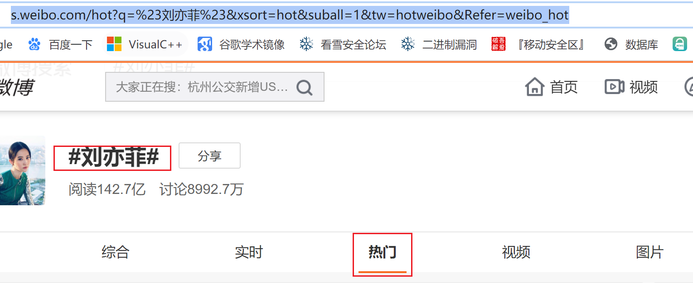

返回结果为如下文件形式的列表：（评论列表供情感分析模块使用）

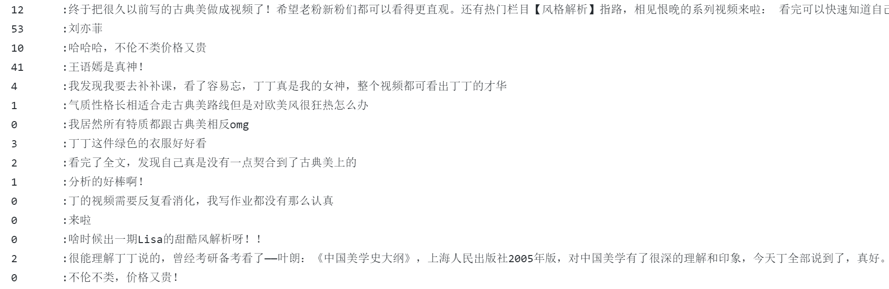


## 基础技术

### AJAX

`Ajax实际就是XMLHttpRequest对象和DOM、(X)HTML和CSS的简称，用于概括异步加载页面内容的技术。实际上，页面是在后台与服务器进行数据交互，获得了数据之后，再利用JavaScript改变网页，这样网页的内容就会被更新了`


常见的表现形式有：

- 网页列表下拉自动刷新内容
- 点击*加载更多* 刷新内容

上面两种形式的内容刷新，浏览器状态栏上的请求URL都不会变化！

**原理如下：**

> *那些刷新的新数据是通过AJAX加载而来的，是一种异步加载方式，原始的页面最初不会包含某些数据，原始页面加载完后，会再向服务器请求某个接口获取数据，然后数据才被处理从而呈现到网页上，这其实就是发送了一个Ajax请求。按照Web发展的趋势来看，这种形式的页面越来越多。网页的原始HTML文档不会包含任何数据，数据都是通过Ajax统一加载后再呈现出来的，这样在Web开发上可以做到前后端分离，而且降低服务器直接渲染页面带来的压力。*


**如何观察一个网页的AJAX请求：（chrome为例）**


刷新页面观察 AJAX请求头、响应头、响应内容等


**如何调试一个网页的AJAX请求：（chrome为例）**

以往的静态页面爬虫，为构造出爬虫的url请求、我们需要分析网页的url规律和参数变化。例如爬取小说目录，我们需要分析每一页的章节数目和页码变化规律，确保爬取到的目录的准确性。

而在AJAX里面我们需要分析AJAX请求头的url的规律，以此作为突破口，制作一个持续的爬虫。同样的我们需要分析url的构造方法。和静态页面不同的是，AJAX的请求url通常非常长、复杂，通过对比方式对比分析出每个参数意义是非常重要的。这里我们可以下载网页的所有资源，然后通过IDE来搜索关键字符换、调试JS，以此查看请求URL的构造和数据的变化！

这里下载插件:chrome 插件 Resources Saver  和 JavaScript IDE webstorrm

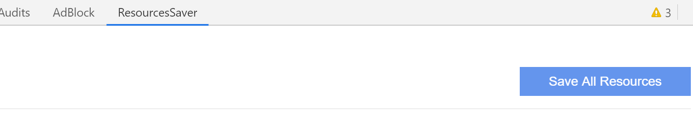

下载所有资源（包括XHR），并用IDE打开，搜索url涉及的关键字等，可以得到意想不到的收获。（以上全部来自自己的无数次的摸索）


参考文章（非常经典） ：[AJAX数据爬取基本认识及原理](https://blog.csdn.net/weixin_42555080/article/details/88318010 ) 


### BeautifulSoup

BeautifulSoup用于解析网页爬虫的返回结果，这里不多叙述。

标记一下很重要的点：

```
1. find寻找标签失败，返回None  若要get其属性，需要判断非None 否则抛出错误

2. 获取标签文本，但是不获取其子标签的文本  get_text()  默认是递归方式获取标签文本
解决方法: comment目标标签  其包含若干个带有文本的子标签   s为comment标签的文本
s = "".join([t for t in comment.contents if type(t) == bs4.element.NavigableString])
```

### selenium

**参考文档** [ selenium参考教程](https://github.com/easonhan007/webdriver_guide/blob/master/README.md)

**注 本文以AJAX请求爬取为主**

除却分析AJAX请求，构造出通用的url外，selenium自动化也是很好的爬取动态网页的方法。

下面是一份 输入评论展示页面url，输出为：

1. 打开浏览器
2. 不断点击评论页面 加载更多 
3. 爬取（未实现 很简单 网页元素加载完毕就可以点击，缺点是较慢、当页面很大时只能一次性解析所有的内容! 优点是简单、稳定）


```
# 教程概览 https://blog.csdn.net/huangbaokang/article/details/83503677
# 教程文档 https://github.com/easonhan007/webdriver_guide/blob/master/README.md
# 元素定位和点击事件 https://github.com/easonhan007/webdriver_guide/blob/master/08/simple_locate.py.md
# 打开浏览器 针对chrome

from selenium import webdriver
import time

from selenium.common.exceptions import NoSuchElementException

# 实现页面自动下移  
def scroll(driver):
    # 获取当前页面滚动条纵坐标的位置
    driver.execute_script(""" 
        (function () { 
            var y = document.documentElement.scrollTop; 
            var step = 100; 
            window.scroll(0, y); 
            function f() { 
                if (y < document.body.scrollHeight) { 
                    y += step; 
                    window.scroll(0, y); 
                    setTimeout(f, 50); 
                }
                else { 
                    window.scroll(0, y); 
                } 
            } 
            setTimeout(f, 1000); 
        })(); 
        """)

# 打开浏览器
dr = webdriver.Chrome()
# 最大化浏览器
dr.maximize_window()
# 设置大小
url = 'https://weibo.com/3165034955/J1aeZFLwk?filter=hot&root_comment_id=0&type=comment'

dr.get(url)
time.sleep(3)

while True:
    scroll(dr)
    try:
        dr.find_element_by_xpath(
            '//*[@id="Pl_Official_WeiboDetail__73"]/div/div/div/div[4]/div/div[2]/div[2]/div/div/a').click()
    except NoSuchElementException:
        print("No such element")
    time.sleep(2)

```


## 评论抓取

### 评论分析

**首先打开一个post的评论页面，页面如下，包含很多的一级评论，每条评论下面都有点赞**


**刷新：查看XHR 、观察Preview数据**

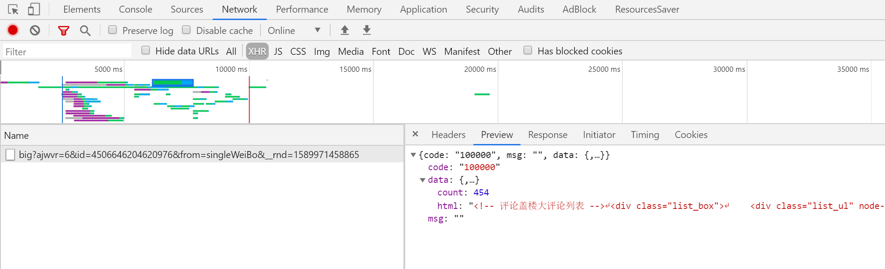

**可以看到：第一条XHR就是第一次加载的评论！**

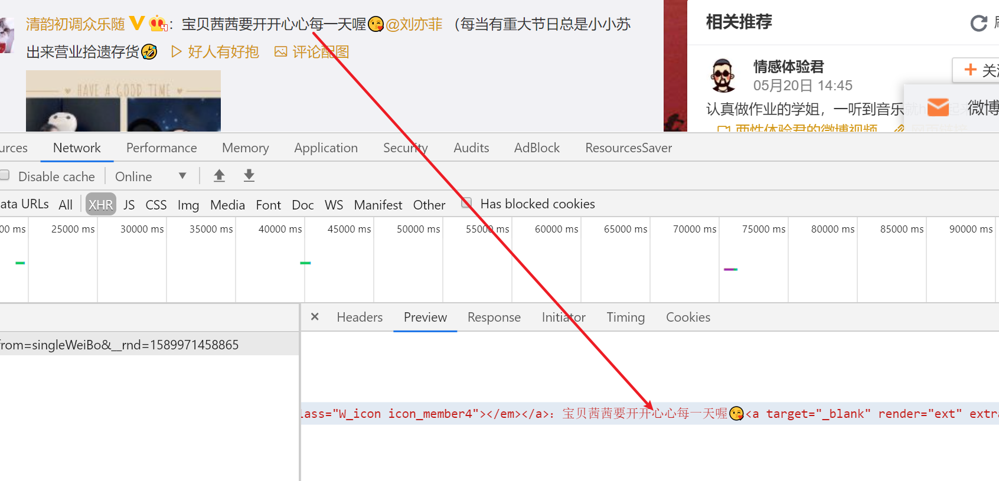

下拉，点击加载更多：加载更多的数据，通过分析查看 以  `https://www.weibo.com/aj/v6/comment/big?ajwvr=6&id=4506646204620976`为首的请求正是我们需要的评论数据

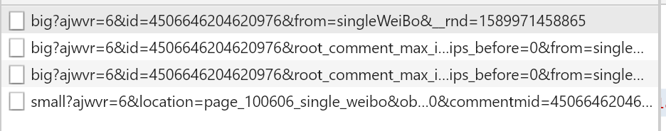

任意请求一个评论页面（和前面的不一样） 复制url请求、分析规律：（**可以在notepad++ 使用compare插件分析**）

```
https://weibo.com/aj/v6/comment/big?ajwvr=6&id=4512539888841055&from=singleWeiBo&__rnd=1591419482709


https://weibo.com/aj/v6/comment/big?ajwvr=6&id=4512539888841055&root_comment_max_id=13885763023819383&root_comment_max_id_type=0&root_comment_ext_param=&page=2&filter=hot&sum_comment_number=46&filter_tips_before=0&from=singleWeiBo&__rnd=1591419501239

https://weibo.com/aj/v6/comment/big?ajwvr=6&id=4512539888841055&root_comment_max_id=140218408395095&root_comment_max_id_type=0&root_comment_ext_param=&page=3&filter=hot&sum_comment_number=79&filter_tips_before=0&from=singleWeiBo&__rnd=1591419502139

https://weibo.com/aj/v6/comment/big?ajwvr=6&id=4512539888841055&root_comment_max_id=138844029830047&root_comment_max_id_type=0&root_comment_ext_param=&page=4&filter=hot&sum_comment_number=95&filter_tips_before=0&from=singleWeiBo&__rnd=1591419581257

https://weibo.com/aj/v6/comment/big?ajwvr=6&id=4512539888841055&root_comment_max_id=138844017932105&root_comment_max_id_type=0&root_comment_ext_param=&page=5&filter=hot&sum_comment_number=110&filter_tips_before=0&from=singleWeiBo&__rnd=1591419595176
```

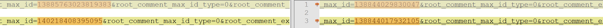

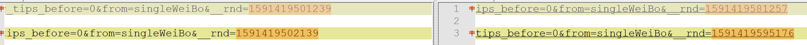


**除去第一条外：其余的url格式是一样的！**

通过上面的对比、总结出非首条URL的规律如下: 

```
dict = {"action_data": action_data, "rnd": __rnd()}
url = "https://weibo.com/aj/v6/comment/big?ajwvr=6&{action_data}&from=singleWeiBo&__rnd={rnd}".format(**dict)
```

**关注action_data 和 rnd 字段**

**action_data** 分析

action_data是很多参数的集合：顾名思义这个是请求动作的参数，一般在当前页面请求下一页这个a标签可以获取！查看网页源码：查看更多标签

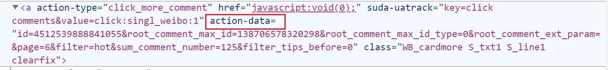

点击这个按钮、查看新的AJAX url: action_data和请求的url的action_data部分完全对应！

```
https://weibo.com/aj/v6/comment/big?ajwvr=6&id=4512539888841055&root_comment_max_id=138706578320298&root_comment_max_id_type=0&root_comment_ext_param=&page=6&filter=hot&sum_comment_number=125&filter_tips_before=0&from=singleWeiBo&__rnd=1591419796024
```

思考一个问题：action_data所在的a标签肯定会通过AJAX请求更新！那么如何通过返回的AJAX请求来提取出这个action_data呢？

查看一个典型的 AJAX结构：json数据的data.html 就是新加入的页面的网页元素！

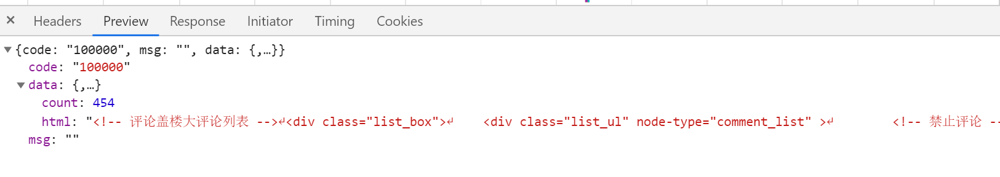

分析内容（爬取并且打印）

```html
<div action-data="id=4506646188218361&amp;root_comment_max_id=9545852827862303&amp;root_comment_max_id_type=0&amp;root_comment_ext_param=&amp;page=2&amp;filter=hot&amp;sum_comment_number=20745&amp;filter_tips_before=0" node-type="comment_loading">
<div class="WB_empty">
<div class="WB_innerwrap">
<div class="empty_con clearfix">
<p class="text"><i class="W_loading"
```

显然：下一个请求的action_data可以从上一个请求的响应数据里构造，而最初的第一个请求的action_data是缺失的，这样就可以连续的构造请求！ **perfect！！！**


**rnd分析**

rnd没有任何的资料，直接查看chrome源码很难受（通过AJAX调试方法，前面介绍过）我们可以下载内容，webstorm打开并且搜索调试：

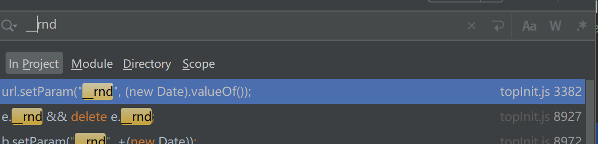

定位如下：这是一个时间戳信息  在python里面是时间戳保留三位小数的结果

```javascript
   url.setParams(opts.args);
                    url.setParam("__rnd", (new Date).valueOf());
                    trans.open(opts.method, url.toString(), opts.asynchronous);
                    try {
                        for (var k in opts.header) trans.setRequestHeader(k, opts.header[k])
                    } catch (exp) {}
```


至此所有的构造出来了，唯一的缺陷是第一条数据的id是哪里来的！我们可以看出每条请求的都要这个ID，一看就知道他是一个类似身份证号的一个主键！

**id分析**

从这个评论页面是看不出来id是这么来的，他是通过搜搜页面的某一个post、然后点击 **评论** 而来的，记住这个id，回到上一页面，搜索这个id！

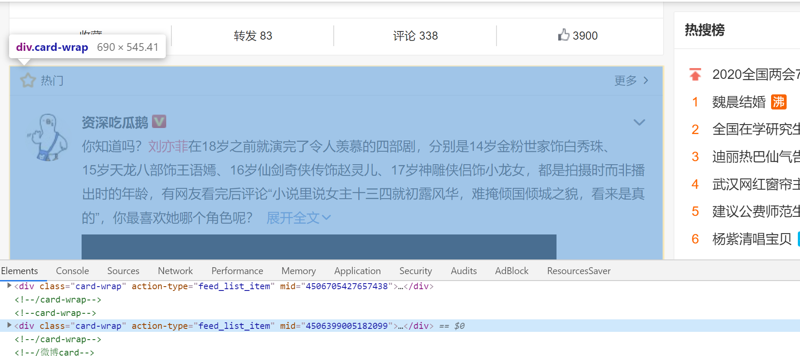


容易发现：所谓的AJAX 请求的id实际上就是这个mid，并且一个`div class="card-wrap"` 就是一个完整的post！

所有我们就可以根据 单纯的一个mid爬取所有的mid对应的post的所有一级评论！

初始的ajax url构造为 `https://www.weibo.com/aj/v6/comment/big?ajwvr=6&id={mid}&from=singleWeiBo&__rnd={__rnd()}`


故而：通过一个mid，我们可以爬取对应的所有一级评论

**爬取请求关键字的mid编号** 

简单的爬取下初始化请求页面页面即可：

` cards = html.find_all("div", attrs={"class": "card-wrap"})`

```python
# 获取开始请求
def get_hot_mid_by_search(search: str):
    search = parse.quote(search)
    search = "https://s.weibo.com/hot?q=%23{0}%23&xsort=hot&suball=1&tw=hotweibo&Refer=weibo_hot".format(search)
    print(search)
    response = requests.get(search)
    html = response.content.decode("utf-8")
    html = BeautifulSoup(html, "lxml")
    cards = html.find_all("div", attrs={"class": "card-wrap"})
    hot_mids = []
    for card in cards:
        mid = card.get("mid")
        if mid:
            hot_mids.append(mid)
    print("热门mid", end="\t")
    print(hot_mids)
    hot_ajax_start = []
    for mid in hot_mids:
        hot_ajax_start.append(
            "https://weibo.com/aj/v6/comment/big?ajwvr=6&id={0}&from=singleWeiBo&__rnd={1}".format(mid, __rnd()))
    return hot_ajax_start
```


**爬取评论页面的赞数和评论内容**

关键点：

1. 只是爬取一级评论、过滤其他
2. 注意判断bs4元素的None、避空指针调用
3. 正确匹配点赞和评论的一一对应关系、防止后期情感分析出现权重错误


还是有点折腾的地方:复制html到notepad++ 分析结构


**一级评论：每一个root_comment就是一个完整的一级评论**

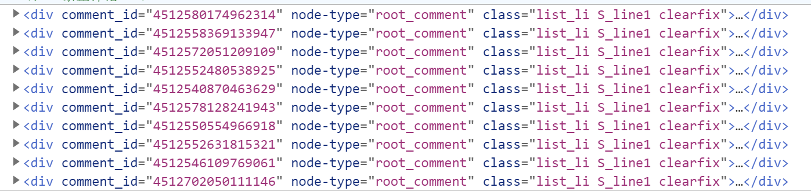

如下：

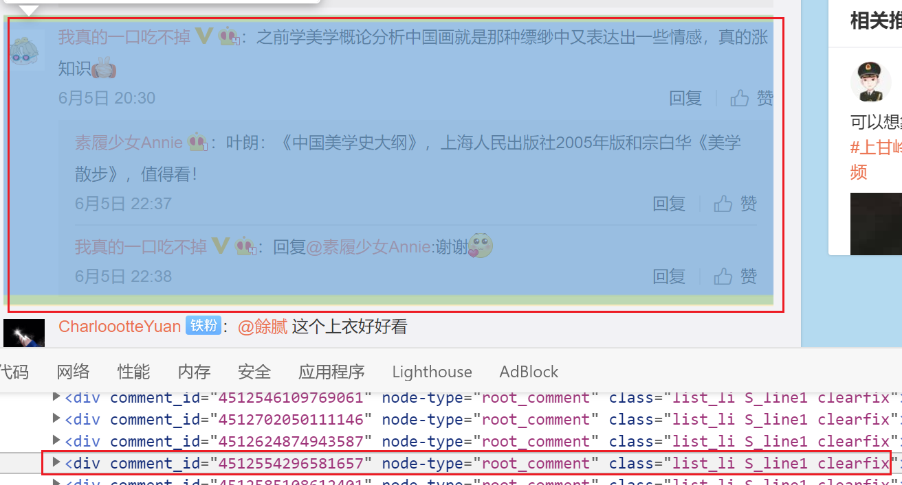

一个很麻烦的是：`root_comment`可能包含二级评论及其点赞、如上所示！

**定位评论和点赞**

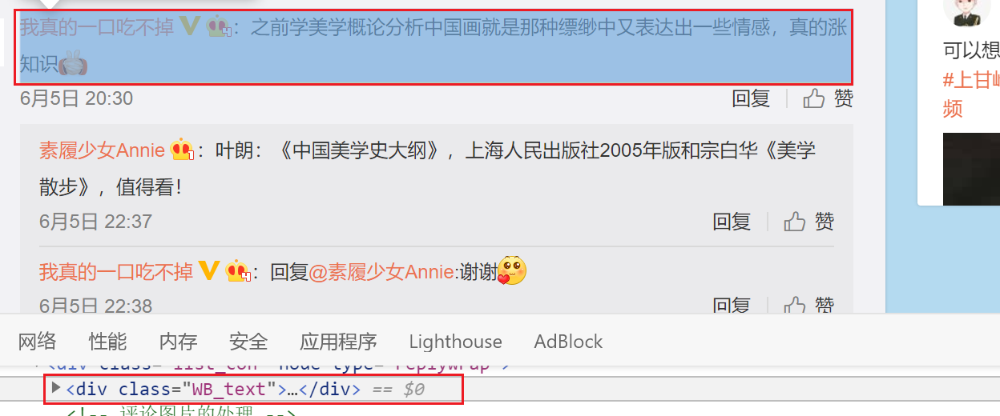

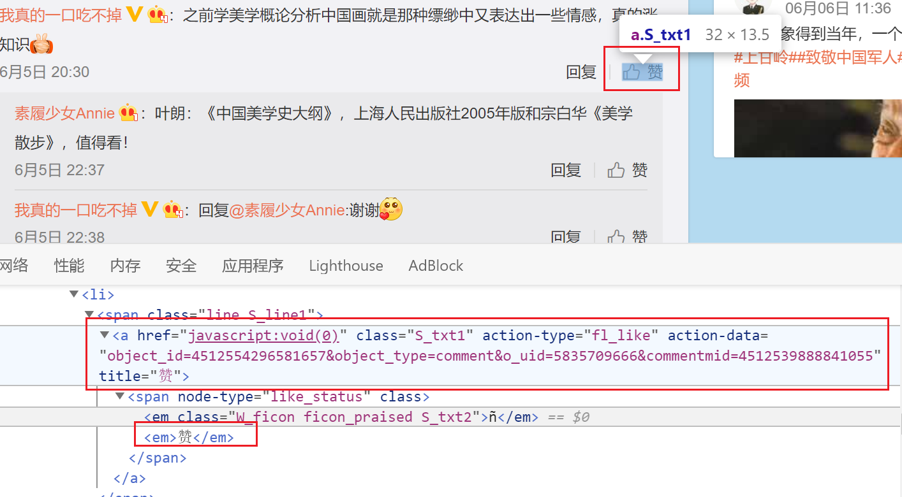

实际上一个root_comment只有一个一级评论和一个一级评论的赞。但是由于部分二级评论嵌套在一级里面，一个root_comment存在多个赞和评论！继续分析结构

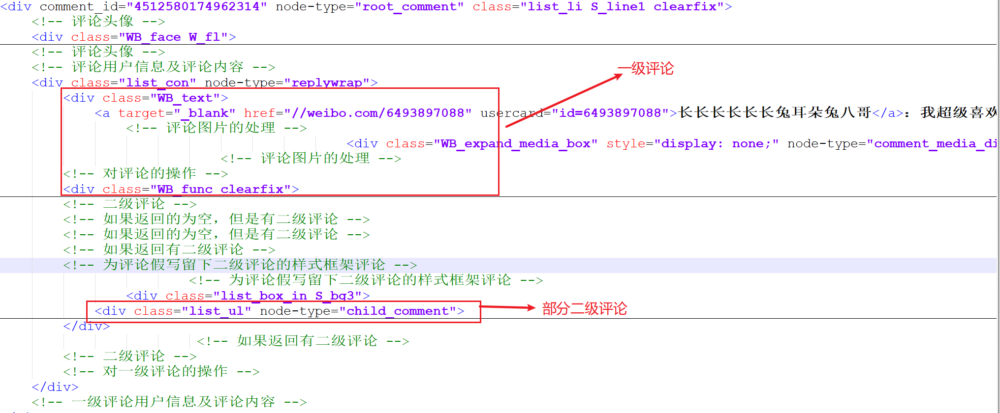

展示内容先是一级然后是2级，所以直接通过root_comment搜出首个赞和评论，就是正确的一级评论！顺序是一一对应的！

**解析的代码：**

```
    if response:
        soup = BeautifulSoup(response.get('data').get('html'), "lxml")
        # 解析评论内容
        root_comments = soup.find_all("div", attrs={"node-type": "root_comment"})
        if not root_comments:
            return None
        for root_comment in root_comments:
            like = root_comment.find("a", attrs={"class": "S_txt1", "action-type": "fl_like", "title": "赞"})
            like = like.find_all("em")[-1].text.strip()
            if like.isdigit():
                pass
            elif like == "赞":
                like = "0"
            else:
                exit(-1)
            # 只是捕获一级评论 过滤二级评论
            comment = root_comment.find("div", attrs={"class": "WB_text"})
            # 评论字符串
            s = "".join([t for t in comment.contents if type(t) == bs4.element.NavigableString])
            s = s.strip().replace("\n", "").lstrip("：").replace("等人", "").replace("回复:", "").strip()
            target = like + "\t:" + s
            print(target)
            result_comments.append(target)

```


### 关于cookie

**以下的内容通过爬虫反复的测试而来**

有如下规则：

1. `https://s.weibo.com/hot?q=%23{keyword}%23&xsort=hot&suball=1&tw=hotweibo&Refer=weibo_hot` 访问不要cookie！ 输入关键字，构造请求url即可

   ```
    response = requests.get(url)
   ```

2. AJAX信息爬取可以不登录，但是一定需要headers和cookie

   为了简化爬取，最好使用不登录的AJAX cookie去爬取（防止用力过猛封号），这里我使用chrome去请求ajax的开始url：例如

   ```
   https://weibo.com/aj/v6/comment/big?ajwvr=6&id=4506646188218361&from=singleWeiBo&__rnd=1589974845914
   ```

   在chrome输入上述的url，会输出一个json内容：

   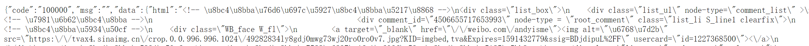

3. **F12 打开chrome开发工具：XHR 刷新页面 查看请求标头**

   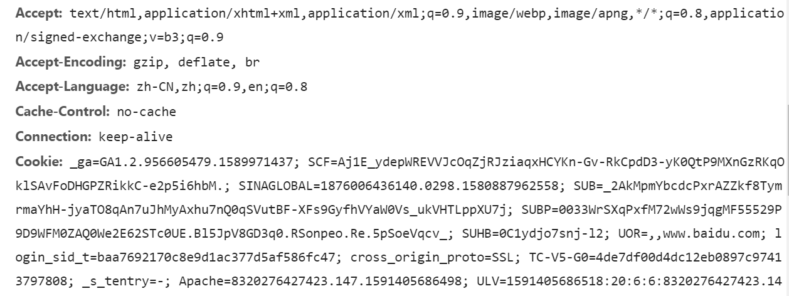

   

4. 复制内容程序的cookie字符串！

   ```
   headers_str = """
   Accept: text/html,application/xhtml+xml,application/xml;q=0.9,image/webp,image/apng,*/*;q=0.8,application/signed-exchange;v=b3;q=0.9
   Accept-Encoding: gzip, deflate, br
   Accept-Language: zh-CN,zh;q=0.9,en;q=0.8
   Cache-Control: no-cache
   ...etc
   '''
   ```

5. 爬取使用单线程、定时sleep，以防止cookie被封！ 下图是我一次用登陆微博账号的cookie爬取数据，爬取的太凶猛了，导致chrome无法正确加载！ AJAX也无法正常请求！

   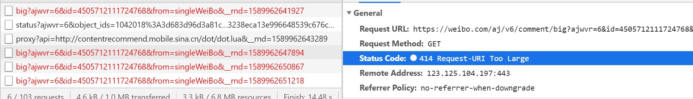

   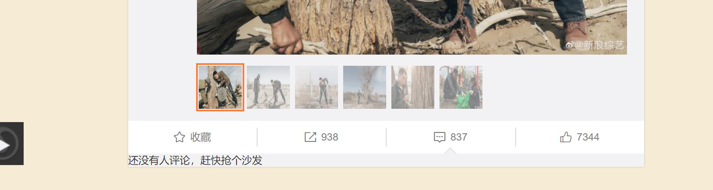


### cookie更新

参照上面关于cookie的第2、3、4步骤，替换程序的cookie字符串！

## 脚本用法

### 

运行脚本：`python3 weibospider.py`

输入查询关键字 `请输入微博查询关键字：刘亦菲`

输出 `控制台信息`、`本机目录下包含{关键字}热门话题评论的 {关键字}.txt  list列表`

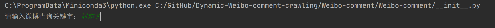


源代码在[gihhub](https://github.com/zhaojunchen/Dynamic-Weibo-comment-crawling/blob/master/Weibo-comment/weibospider.py) 可找到！


