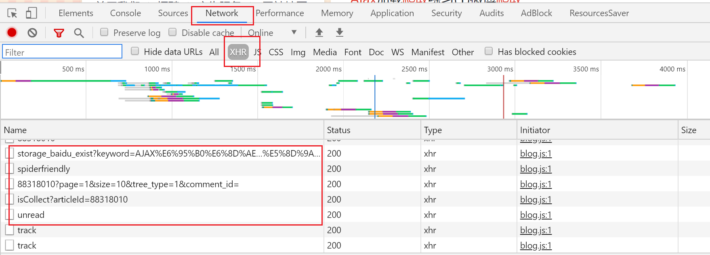

# 微博热门评论爬取

## 编程目标

实现给定关键词，爬取搜索页面 `https://s.weibo.com/weibo?q={keword}&` 所有标记有"热门" post的所有一级评论，并保存于txt，用于情感分析材料。


例如:  搜索目标关键字 **刘亦菲**  即是访问网页 `https://s.weibo.com/weibo?q=刘亦菲&` 所有带有热门关键词的微博评论

## 技术应用

### AJAX

`Ajax实际就是XMLHttpRequest对象和DOM、(X)HTML和CSS的简称，用于概括异步加载页面内容的技术。实际上，页面是在后台与服务器进行数据交互，获得了数据之后，再利用JavaScript改变网页，这样网页的内容就会被更新了`


常见的表现形式有：

- 网页列表下拉自动刷新新内容
- 点击*加载更多* 刷新新内容

上面两种形式在浏览器状态栏上的请求URL都不会变化！

**原理如下：**

> *那些刷新的新数据是通过AJAX加载而来的，是一种异步加载方式，原始的页面最初不会包含某些数据，原始页面加载完后，会再向服务器请求某个接口获取数据，然后数据才被处理从而呈现到网页上，这其实就是发送了一个Ajax请求。按照Web发展的趋势来看，这种形式的页面越来越多。网页的原始HTML文档不会包含任何数据，数据都是通过Ajax统一加载后再呈现出来的，这样在Web开发上可以做到前后端分离，而且降低服务器直接渲染页面带来的压力。*
>


如何观察一个网页的AJAX请求：（chrome为例）**



刷新页面观察 AJAX请求头、响应头、相应内容等


**如何调试一个网页的AJAX请求：（chrome为例）**

以往的静态页面爬虫，为构造出爬虫的url请求、我们需要分析网页的url规律和参数变化。例如爬取小说目录，我们需要分析每一页的章节数目和变化规律，确保目录的准确性！

而在AJAX里面我们需要分析AJAX请求头的url的规律，一次作为突破口，制作一个持续的爬虫。常常我们需要url

的构造方法，和静态页面不同的是，AJAX的请求url通常非常长和复杂，对比分析出每个参数意义是非常重要的。这里我们可以下载网页的所有资源，让后通过IDE来搜索调试，查看请求URL的构造和数据的变化！

这里下载插件:chrome 插件 Resources Saver  和 JavaScript IDE webstorrm


下载所有资源，并用IDE打开，搜索url涉及的关键字等，可以得到意想不到的收获。（以上全部来自自己的无数次的摸索）


参考文章（非常经典） ： https://blog.csdn.net/weixin_42555080/article/details/88318010 


### BeautifulSoup

BeautifulSoup用于解析网页爬虫的返回结果，这里不多叙述（课程上有讲）

标记一下很重要的点：

```
1. find寻找标签失败，返回None  若要get其属性，需要判断 非None 否则抛出错误

2. 获取标签文本，但是不获取其子标签的文本  get_text()  默认是递归方式获取标签文本
解决方法: comment目标标签  其包含若干个带有文本的子标签   s为comment标签的文本
s = "".join([t for t in comment.contents if type(t) == bs4.element.NavigableString])
```


## 微博评论

### 评论分析

首先打开一个post的评论页面，页面如下，包含很多的以及评论


参考文章
微博爬取 https://blog.csdn.net/weixin_42555080/article/details/88363040

## 请求头构造
快速构造请求头 https://www.jianshu.com/p/b671f67a5960

## selenium

